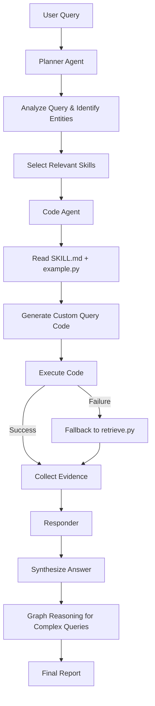

<p align="center">
  
</p>

<h1 align="center">DrugClaw</h1>
<p align="center">
  <strong>AI-powered full-stack drug discovery assistant based on OpenClaw</strong><br>
  Accelerate your drug discovery workflow from literature analysis to experimental design
</p>

<p align="center">
  <a href="https://github.com/caroline-li-bot/DrugClaw/blob/main/LICENSE"></a>
  <a href="https://pypi.org/project/drugclaw/"></a>
  <a href="https://pepy.tech/project/drugclaw"></a>
  <a href="https://github.com/psf/black"></a>
</p>

<p align="center">
  <a href="/README_CN.md">中文 README</a> | 
  <a href="https://drug.openclaw.ai">Live Demo</a> |
  <a href="#quick-start">Quick Start</a> |
  <a href="#-skill-tree">Skill Tree</a>
</p>

---

DrugClaw is an OpenClaw-native drug discovery automation assistant that accelerates the entire drug discovery workflow from literature analysis to experimental design. It combines tool use, domain skills, and agentic automation to help researchers get things done faster.

## 🎯 What DrugClaw Does

DrugClaw covers the full drug discovery pipeline with an agentic workflow:

### 🔍 Literature & Knowledge
- **Literature Analysis** - Automatic PubMed search, key information extraction, trend analysis
- **Target Intelligence** - Build target dossiers from UniProt, OpenTargets, Reactome, STRING, ClinVar
- **Evidence Synthesis** - Aggregate evidence from multiple databases for reasoned conclusions

### 🧪 Compound Screening & Prediction
- **Virtual Screening** - Automated molecular docking with AutoDock Vina, post-processing and ranking
- **ADMET Prediction** - Heuristic ADMET property prediction using ChemBERTa
- **Drug-Target Interaction (DTI)** - Query ChEMBL, BindingDB, DGIdb, TTD for known interactions
- **Molecule Generation** - Generate novel molecules based on scaffold constraints

### 📊 Data Analysis & Experimental Design
- **Experimental Protocol Design** - Automatic cell/animal experiment protocol generation
- **Statistical Analysis** - Automated data processing, visualization and statistical testing
- **Clinical Trial Design** - Protocol design assistance, eligibility criteria selection

### 🔬 Domain-Specific Skills

| Category | Description |
|----------|-------------|
| **Adverse Drug Reactions (ADR)** | Query FAERS, SIDER, nSIDES for adverse drug reactions |
| **Drug-Drug Interactions (DDI)** | Check interaction data from multiple sources |
| **Pharmacogenomics (PGx)** | Query PharmGKB for genotype-guided dosing |
| **Drug Repurposing** | Identify repurposing opportunities from RepoDB, DRKG |
| And more... | See full [skill tree](#-skill-tree) below |

## 🤖 Agentic Workflow

Inspired by [QSong-github/DrugClaw](https://github.com/QSong-github/DrugClaw), DrugClaw follows an agentic retrieval-execution pattern:



1. **Planner Agent** - Analyzes the query, identifies entities, selects relevant skills
2. **Code Agent** - Reads skill documentation, writes and executes resource-specific query code ("vibe coding")
3. **Fallback Mechanism** - If code generation fails, falls back to pre-written deterministic retrieval scripts
4. **Reasoning & Synthesis** - Aggregates evidence from multiple sources and generates a structured report

Three thinking modes:
- **SIMPLE** - Direct retrieval and answer for simple queries
- **GRAPH** - Graph-based multi-hop evidence synthesis for complex queries
- **WEB_ONLY** - Use only web search for recent information

## 🗺️ Skill Tree (15 Categories)

| Category | Description | Data Sources |
|----------|-------------|--------------|
| **dti** | Drug-Target Interactions | ChEMBL, BindingDB, DGIdb, Open Targets, TTD, STITCH |
| **adr** | Adverse Drug Reactions | FAERS, SIDER, nSIDES, ADReCS |
| **ddi** | Drug-Drug Interactions | MecDDI, DDInter, KEGG Drug |
| **pgx** | Pharmacogenomics | PharmGKB, CPIC |
| **repurposing** | Drug Repurposing | RepoDB, DRKG, OREGANO, Drug Repurposing Hub |
| **knowledgebase** | Drug Knowledgebases | DrugBank, UniD3, IUPHAR/BPS, DrugCentral, WHO Essential Medicines |
| **mechanism** | Mechanisms of Action | DRUGMECHDB |
| **labeling** | Drug Labeling | DailyMed, openFDA, MedlinePlus |
| **toxicity** | Drug Toxicity | UniTox, LiverTox, DILIrank |
| **ontology** | Ontology & Normalization | RxNorm, ChEBI, ATC/DDD |
| **combination** | Drug Combinations | DrugCombDB, DrugComb |
| **properties** | Molecular Properties | GDSC, ChemBERTa |
| **disease** | Drug-Disease Associations | SemaTyP |
| **reviews** | Patient Reviews | WebMD, Drugs.com |
| **nlp** | NLP Datasets | DDI Corpus, DrugProt, ADE Corpus, CADEC |

## 🛠️ Tech Stack

- **OpenClaw** - Agent framework, skill system, memory, multi-channel support
- **RDKit** - Cheminformatics
- **ChemBERTa-2** - Molecular property prediction
- **ESMFold** - Protein structure prediction
- **DiffDock** - Molecular docking
- **AutoDock Vina** - Virtual screening
- **LangChain** - RAG and agent orchestration
- **OpenAI API** - LLM for code generation and reasoning
- **Supabase** - Cloud database (optional)
- **Flask** - Web UI

## 📦 Installation

```bash
# Clone the repository
git clone https://github.com/caroline-li-bot/DrugClaw.git
cd DrugClaw

# Create virtual environment
python3 -m venv .venv
source .venv/bin/activate

# Install dependencies
pip install -r requirements.txt

# Install the package
pip install -e .

# Install as OpenClaw skill
openclaw skill install .
```

See [DEPLOYMENT.md](/DEPLOYMENT.md) for more deployment options.

## 🚀 Quick Start

### 1. Configure your API key

```bash
cp navigator_api_keys.example.json navigator_api_keys.json
# Edit navigator_api_keys.json and add your OpenAI API key
```

### 2. Check your setup

```bash
drugclaw doctor
drugclaw list
```

### 3. Run the demo

```bash
drugclaw demo
```

### 4. Run your own query

```bash
# Simple query
drugclaw run --query "What are the known drug targets of imatinib?"

# Complex query with graph reasoning
drugclaw run --query "What are the adverse drug reactions and interaction risks of combining warfarin with NSAIDs?" --thinking-mode graph

# Save as Markdown report
drugclaw run --query "Which approved drugs can be repurposed for triple-negative breast cancer?" --save-md-report
```

### As OpenClaw Skill

In OpenClaw chat, just ask naturally:
```
Find all known targets of imatinib and summarize potential adverse interactions
```

## ☁️ Web Deployment

DrugClaw can be deployed to Vercel with Supabase backend. See [DEPLOYMENT_VERCEL_SUPABASE.md](/DEPLOYMENT_VERCEL_SUPABASE.md) for step-by-step instructions.

## 📁 Project Structure

```
DrugClaw/
├── drugclaw/                    # Main Python package
│   ├── __init__.py
│   ├── agent/                   # Agent architecture
│   │   ├── planner.py           # Query planning agent
│   │   ├── code_agent.py        # Code generation agent
│   │   └── responder.py         # Final answer synthesizer
│   ├── cli.py                   # Command-line interface
│   ├── config.py                # Configuration handling
│   └── main_system.py           # Main system entrypoint
├── skills/                      # 15-category skill tree
│   ├── dti/                     # Drug-Target Interactions
│   │   └── chembl/              # Per-source skill: SKILL.md, example.py, retrieve.py
│   ├── adr/                     # Adverse Drug Reactions
│   ├── ddi/                     # Drug-Drug Interactions
│   ├── pgx/                     # Pharmacogenomics
│   ├── repurposing/             # Drug Repurposing
│   ├── knowledgebase/           # Drug Knowledgebases
│   ├── mechanism/               # Mechanisms of Action
│   ├── labeling/                # Drug Labeling
│   ├── toxicity/                # Drug Toxicity
│   ├── ontology/                # Ontology & Normalization
│   ├── combination/             # Drug Combinations
│   ├── properties/              # Molecular Properties
│   ├── disease/                 # Drug-Disease Associations
│   ├── reviews/                 # Patient Reviews
│   └── nlp/                     # NLP Datasets
├── utils/                       # Utilities
│   ├── chem_utils.py            # Cheminformatics tools
│   ├── db_utils.py              # Database utilities
│   ├── ml_utils.py              # ML models
│   ├── sota_models.py           # SOTA models (ChemBERTa, ESMFold, DiffDock)
│   └── supabase_utils.py        # Supabase integration (optional)
├── web/                         # Web interface
│   ├── app.py                   # Flask backend
│   ├── templates/               # HTML templates
│   └── static/                  # CSS/JS assets
├── supabase/                    # Supabase configuration
│   └── migrations/              # Database migrations
├── examples/                    # Example usage scripts
├── docs/                        # Documentation
├── support/                     # Project assets (logo, images)
├── requirements.txt             # Python dependencies
├── pyproject.toml               # Package configuration
├── skill.yaml                   # OpenClaw skill manifest
└── README.md                    # This file
```

## 🎯 Differences from other DrugClaw projects

| Aspect | [DrugClaw/DrugClaw](https://github.com/DrugClaw/DrugClaw) | [QSong-github/DrugClaw](https://github.com/QSong-github/DrugClaw) | **caroline-li-bot/DrugClaw** |
|--------|-------------------|------------------------|-------------------|
| **Base** | Rust agent runtime | LangGraph Agentic RAG | **OpenClaw-native skill** |
| **Scope** | Full research workflow automation | Drug knowledge QA | **Full-stack drug discovery automation + agentic RAG** |
| **Philosophy** | Generic agent with drug skills | Specialized RAG for drug questions | **Best of both: OpenClaw agent + 15-category skill tree + agentic workflow** |
| **Key Feature** | Multi-channel support, persistent memory | Structured skill tree, vibe coding retrieval | OpenClaw integration, optional cloud deployment |

## 📊 Example Queries

- "What are the known targets, adverse effects, and interaction risks of imatinib?"
- "Which approved drugs may be repurposed for triple-negative breast cancer?"
- "What pharmacogenomic guidance exists for clopidogrel and CYP2C19?"
- "Are there clinically meaningful interactions between warfarin and NSAIDs?"
- "Predict ADMET properties for this SMILES: `CC1=CC=C(C=C1)NC(=O)C2=CC=C(O)C=C2`"

## 📄 License

MIT License - see [LICENSE](/LICENSE) for details.

## 🙏 Acknowledgments

- Inspired by [DrugClaw/DrugClaw](https://github.com/DrugClaw/DrugClaw) and [QSong-github/DrugClaw](https://github.com/QSong-github/DrugClaw)
- Built on top of the [OpenClaw](https://github.com/openclaw/openclaw) agent framework
- Uses publicly available biomedical databases and open-source tools

---

*DrugClaw is for research purposes only. It does not provide medical advice. All predictions should be experimentally validated.*
