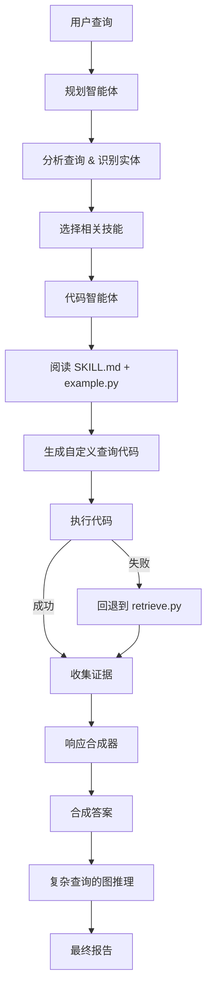

<p align="center">
  
</p>

<h1 align="center">DrugClaw</h1>
<p align="center">
  <strong>基于 OpenClaw 的全栈药物发现 AI 自动化助手</strong><br>
  加速从文献分析到实验设计的完整药物发现流程
</p>

<p align="center">
  <a href="https://github.com/caroline-li-bot/DrugClaw/blob/main/LICENSE"></a>
  <a href="https://pypi.org/project/drugclaw/"></a>
  <a href="https://img.shields.io/badge/domain-drug%20discovery-blue.svg"></a>
  <a href="https://github.com/psf/black"></a>
</p>

<p align="center">
  <a href="https://github.com/caroline-li-bot/DrugClaw/blob/main/README.md">English README</a> | 
  <a href="https://drug.openclaw.ai">在线演示</a> |
  <a href="https://github.com/caroline-li-bot/DrugClaw#%E5%BF%AB%E9%80%9F%E5%BC%80%E5%A7%8B">快速开始</a> |
  <a href="https://github.com/caroline-li-bot/DrugClaw#-skill-tree">技能树</a>
</p>

---

DrugClaw 是 OpenClaw 原生的药物研发自动化助手，结合了领域技能、工具调用和智能自动化，帮助研究人员更快地完成工作。

## 🎯 DrugClaw 能做什么

DrugClaw 覆盖完整的药物发现流水线，支持智能工作流：

### 🔍 文献与知识
- **文献分析** - 自动 PubMed 搜索，关键信息提取，研究趋势分析
- **靶标情报** - 整合 UniProt、OpenTargets、Reactome、STRING、ClinVar 构建靶标档案
- **证据合成** - 从多个数据库聚合证据，推导出有理有据的结论

### 🧪 化合物筛选与预测
- **虚拟筛选** - 自动化 AutoDock Vina 分子对接，后处理和排名
- **ADMET 预测** - 使用 ChemBERTa 进行启发式 ADMET 性质预测
- **药物-靶标相互作用 (DTI)** - 查询 ChEMBL、BindingDB、DGIdb、TTD 已知相互作用
- **分子生成** - 基于骨架约束生成新型分子

### 📊 数据分析与实验设计
- **实验方案设计** - 自动生成细胞/动物实验方案
- **统计分析** - 自动化数据处理、可视化和统计检验
- **临床试验设计** - 方案设计辅助，入组标准选择

### 🔬 领域专项技能

| 分类 | 描述 |
|------|------|
| **药物不良反应 (ADR)** | 查询 FAERS、SIDER、nSIDES 药物不良反应 |
| **药物-药物相互作用 (DDI)** | 从多个数据源检查相互作用 |
| **药物基因组学 (PGx)** | 查询 PharmGKB 基因型指导用药 |
| **药物重定位** | 从 RepoDB、DRKG 识别重定位机会 |
| 更多... | 见下方完整[技能树](https://github.com/caroline-li-bot/DrugClaw#-skill-tree) |

## 🤖 智能工作流

借鉴了 [QSong-github/DrugClaw](https://github.com/QSong-github/DrugClaw) 的设计，DrugClaw 遵循检索-执行智能体模式：



1. **规划智能体** - 分析查询，识别实体，选择相关技能
2. **代码智能体** - 阅读技能文档，编写并执行特定数据源的查询代码 ("vibe coding")
3. **回退机制** - 如果代码生成失败，自动回退到预编写的确定性检索脚本
4. **推理合成** - 聚合多个来源的证据，生成结构化报告

三种思考模式：
- **SIMPLE** - 简单查询直接检索回答
- **GRAPH** - 基于图的多跳证据合成，用于复杂查询
- **WEB_ONLY** - 仅使用网络搜索获取最新信息

## 🗺️ 技能树 (15 个分类)

| 分类 | 描述 | 数据源 |
|------|------|--------|
| **dti** | 药物-靶标相互作用 | ChEMBL, BindingDB, DGIdb, Open Targets, TTD, STITCH |
| **adr** | 药物不良反应 | FAERS, SIDER, nSIDES, ADReCS |
| **ddi** | 药物-药物相互作用 | MecDDI, DDInter, KEGG Drug |
| **pgx** | 药物基因组学 | PharmGKB, CPIC |
| **repurposing** | 药物重定位 | RepoDB, DRKG, OREGANO, Drug Repurposing Hub |
| **knowledgebase** | 药物知识库 | DrugBank, UniD3, IUPHAR/BPS, DrugCentral, WHO 基本药物目录 |
| **mechanism** | 作用机制 | DRUGMECHDB |
| **labeling** | 药品说明书 | DailyMed, openFDA, MedlinePlus |
| **toxicity** | 药物毒性 | UniTox, LiverTox, DILIrank |
| **ontology** | 本体与标准化 | RxNorm, ChEBI, ATC/DDD |
| **combination** | 药物组合 | DrugCombDB, DrugComb |
| **properties** | 分子性质 | GDSC, ChemBERTa |
| **disease** | 药物-疾病关联 | SemaTyP |
| **reviews** | 患者评价 | WebMD, Drugs.com |
| **nlp** | NLP 数据集 | DDI Corpus, DrugProt, ADE Corpus, CADEC |

## 🛠️ 技术栈

- **OpenClaw** - 智能体框架，技能系统，记忆，多通道支持
- **RDKit** - 化学信息学
- **ChemBERTa-2** - 分子性质预测
- **ESMFold** - 蛋白质结构预测
- **DiffDock** - 分子对接
- **AutoDock Vina** - 虚拟筛选
- **LangChain** - RAG 和智能体编排
- **OpenAI API** - 用于代码生成和推理的大语言模型
- **Supabase** - 云数据库（可选）
- **Flask** - Web 界面

## 📦 安装

```bash
# 克隆仓库
git clone https://github.com/caroline-li-bot/DrugClaw.git
cd DrugClaw

# 创建虚拟环境
python3 -m venv .venv
source .venv/bin/activate

# 安装依赖
pip install -r requirements.txt

# 安装包
pip install -e .

# 作为 OpenClaw 技能安装
openclaw skill install .
```

更多部署选项见 [DEPLOYMENT.md](https://github.com/caroline-li-bot/DrugClaw/blob/main/DEPLOYMENT.md)。

## 🚀 快速开始

### 🎯 端到端示例：针对你的靶标发现新药

如果你有一个蛋白靶标，想发现新的结合分子：

```bash
# 1. 安装系统依赖（AutoDock Vina, OpenBabel, MGLTools）
sudo ./scripts/install_system_deps.sh

# 2. 文献调研 - 了解靶标功能和疾病相关性
drugclaw run --query "Summarize recent research on TREM2 role in Alzheimer's disease"

# 3. 获取靶标信息整合
drugclaw run --query "Get target information for TREM2 including function and disease association"

# 4. 下载化合物库样本
python scripts/download_public_datasets.py --dataset zinc_15_sample --output-dir ./data

# 5. ADMET 预筛选 - 过滤掉不好的化合物
drugclaw run --query "Predict ADMET for all compounds in data/zinc_15_sample/2k-compound-sample.csv --output admet_filtered.csv"

# 6. 并行虚拟筛选 ✨ 自动使用全部 CPU 核心
drugclaw virtual-screening \
  --receptor ./trem2.pdb \
  --center-x 10.0 --center-y 20.0 --center-z 30.0 \
  --size-x 20 --size-y 20 --size-z 20 \
  --input ./admet_filtered.csv \
  --output ./trem2_screening_results.csv
```

完成！结果按亲和力排序（越低越好），你可以直接取 top N 拿去实验验证。

---

### 1. 配置 API 密钥

```bash
cp navigator_api_keys.example.json navigator_api_keys.json
# 编辑 navigator_api_keys.json 添加你的 OpenAI API 密钥
```

### 2. 检查配置

```bash
drugclaw doctor
drugclaw list
```

### 3. 运行演示

```bash
drugclaw demo
```

### 4. 运行你的查询

```bash
# 简单查询
drugclaw run --query "imatinib 已知的药物靶标有哪些？"

# 复杂查询使用图推理
drugclaw run --query "华法林与 NSAIDs 联用有哪些临床意义重大的相互作用？" --thinking-mode graph

# 保存为 Markdown 报告
drugclaw run --query "哪些已批准药物可以重定位用于三阴性乳腺癌？" --save-md-report
```

### 作为 OpenClaw 技能使用

在 OpenClaw 聊天中直接自然提问：
```
查找 imatinib 所有已知靶标并总结潜在的不良相互作用
```

## ☁️ Web 部署

DrugClaw 可以部署到 Vercel 使用 Supabase 后端。详见 [DEPLOYMENT_VERCEL_SUPABASE.md](https://github.com/caroline-li-bot/DrugClaw/blob/main/DEPLOYMENT_VERCEL_SUPABASE.md)。

## 📁 项目结构

```
DrugClaw/
├── drugclaw/                    # Python 主包
│   ├── __init__.py
│   ├── agent/                   # 智能体架构
│   │   ├── planner.py           # 查询规划智能体
│   │   ├── code_agent.py        # 代码生成智能体
│   │   └── responder.py         # 最终答案合成
│   ├── cli.py                   # 命令行接口
│   ├── config.py                # 配置处理
│   └── main_system.py           # 主系统入口
├── skills/                      # 15分类技能树
│   ├── dti/                     # 药物-靶标相互作用
│   │   └── chembl/              # 每个数据源: SKILL.md, example.py, retrieve.py
│   ├── adr/                     # 药物不良反应
│   ├── ddi/                     # 药物-药物相互作用
│   ├── pgx/                     # 药物基因组学
│   ├── repurposing/             # 药物重定位
│   ├── knowledgebase/           # 药物知识库
│   ├── mechanism/               # 作用机制
│   ├── labeling/                # 药品说明书
│   ├── toxicity/                # 药物毒性
│   ├── ontology/                # 本体与标准化
│   ├── combination/             # 药物组合
│   ├── properties/              # 分子性质
│   ├── disease/                 # 药物-疾病关联
│   ├── reviews/                 # 患者评价
│   └── nlp/                     # NLP 数据集
├── utils/                       # 工具库
│   ├── chem_utils.py            # 化学信息学工具
│   ├── db_utils.py              # 数据库工具
│   ├── ml_utils.py              # 机器学习模型
│   ├── sota_models.py           # SOTA 模型 (ChemBERTa, ESMFold, DiffDock)
│   └── supabase_utils.py        # Supabase 集成（可选）
├── web/                         # Web 界面
│   ├── app.py                   # Flask 后端
│   ├── templates/               # HTML 模板
│   └── static/                  # CSS/JS 资源
├── supabase/                    # Supabase 配置
│   └── migrations/              # 数据库迁移
├── examples/                    # 示例使用脚本
├── docs/                        # 文档
├── support/                     # 项目资源（logo，图片）
├── requirements.txt             # Python 依赖
├── pyproject.toml               # 包配置
├── skill.yaml                   # OpenClaw 技能清单
└── README.md                    # 本文件
```

## 🎯 与其他 DrugClaw 项目的区别

| 方面 | [DrugClaw/DrugClaw](https://github.com/DrugClaw/DrugClaw) | [QSong-github/DrugClaw](https://github.com/QSong-github/DrugClaw) | **caroline-li-bot/DrugClaw** |
|------|-------------------|------------------------|-----------------------------|
| **基础** | Rust 智能体运行时 | LangGraph Agentic RAG | **OpenClaw 原生技能** |
| **范围** | 完整研究工作流自动化 | 药物知识问答 | **全栈药物发现自动化 + Agentic RAG** |
| **理念** | 带药物技能的通用智能体 | 专门用于药物问题的 RAG | **结合两者优势：OpenClaw 智能体 + 15分类技能树 + 智能工作流** |
| **核心特性** | 多通道支持，持久化记忆 | 结构化技能树，vibe coding 检索 | OpenClaw 集成，可选云端部署 |

## 📊 示例查询

- "imatinib 已知的靶标、不良反应和相互作用风险有哪些？"
- "哪些已批准药物可以重定位用于三阴性乳腺癌？"
- "氯吡格雷和 CYP2C19 有什么药物基因组学指导？"
- "华法林和 NSAIDs 之间存在临床意义的相互作用吗？"
- "预测这个 SMILES 的 ADMET 性质：`CC1=CC=C(C=C1)NC(=O)C2=CC=C(O)C=C2`"

## 📄 许可证

MIT License - 详见 [LICENSE](/LICENSE)。

## 🙏 致谢

- 灵感来自 [DrugClaw/DrugClaw](https://github.com/DrugClaw/DrugClaw) 和 [QSong-github/DrugClaw](https://github.com/QSong-github/DrugClaw)
- 基于 [OpenClaw](https://github.com/openclaw/openclaw) 智能体框架构建
- 使用了公开可用的生物医学数据库和开源工具

---

*DrugClaw 仅用于研究目的。不提供医疗建议。所有预测都需要实验验证。*
